# Earlytool

## Description
Repo for Early Tool

## Installation
It requires 3.8+ version of Python.

```sh
git clone https://gitlab.abo.fi/veridevops/earlytool
cd earlytool
pip install -r requirement.txt
```

## Usage
It has two main components which should be executed in separate console windows.

### 1) Monitor
This component reads packets either from a PCAP file or a network interface. It constructs flows and get corresponding predictions from a given model. It runs a HTTP server which can be used to get fetch flows information.

```sh
usage: early.py [-h] (-i INPUT_INTERFACE | -f INPUT_FILE) [-c--classifier CLASSIFIER_MODULE] [-d DELAY_MILLISECOND]

optional arguments:
  -h, --help            show this help message and exit
  -i INPUT_INTERFACE, --interface INPUT_INTERFACE
                        capture online data from INPUT_INTERFACE
  -f INPUT_FILE, --file INPUT_FILE
                        capture offline data from INPUT_FILE
  -c--classifier CLASSIFIER_MODULE
                        Classifier module used for making predictions. Default: classifier/random_classifier.py
  -d DELAY_MILLISECOND  Add a delay of d milliseconds after sniffing a packet. E.g., 0 (default: no delay)
```

Read packets from a PCAP file:
```sh
python early.py -f example_pcap/traffic_5f_ni.pcap
```

Or capture packets from a network interface: (**need root permission**)
```sh
sudo python early.py -i eno1
```

### 2) Command Line Interface Display
This component fetches results from the monitor and displays flows in the command line.

```sh
usage: display.py [-h] [-u URL_EARLY] [-s--show_flows SHOW_FLOWS] [-w WARNING_THRESHOLD] [-a ALERT_THRESHOLD] [-r REFRESH_MILLISECOND]

optional arguments:
  -h, --help            show this help message and exit
  -u URL_EARLY, --url URL_EARLY
                        URL endpoint to get updates from Early tool. e.g 0.0.0.0:9400 (default)
  -s--show_flows SHOW_FLOWS
                        Maximum number of flows to display.
  -w WARNING_THRESHOLD  Warning threshold. E.g., 40.0 (default)
  -a ALERT_THRESHOLD    Alert threshold. E.g., 60.0 (default)
  -r REFRESH_MILLISECOND
                        Refresh results after every r milliseconds. E.g., 250 (default)
```

## Example

1) Run the **display** to show 50 recently updated flows and update the results after every 500 milliseconds.

```sh
python display.py -s 50 -r 500 -w 40 -a 50 
```


2) Run the **monitor** to read every packet from the given PCAP file with a delay of 1000 milliseconds and use a trained model to get predictions:
```sh
python early.py -f example_pcap/traffic_5f_ni.pcap -c classifier/trained_classifier.py -d 1000
```


