# Earlytool

## Description

Repo for Early Tool

## Installation

It requires 3.6+ version of Python.

```sh
git clone https://gitlab.abo.fi/veridevops-public/earlytool
cd earlytool
python setup.py install
```

## Usage

It has two main components which should be executed in separate console windows.

### 1) Monitor

This component reads packets either from a PCAP file or a network interface. It constructs flows and get corresponding predictions from a given model. It runs a HTTP server which can be used to get fetch flows information.

```sh
Usage: early_monitor [OPTIONS]

Options:
  -i, --interface TEXT      Analyze live data from the network interface.
  -f, --pfile FILE          Analyze data from a PCAP file.
  -b, --bpf-filter TEXT     Filter network traffic using BPFs.  [default: ip and (tcp or udp)]
  -c, --classifier FILE     Path to a classifier python module that will be used for making predictions. If the module exists in the early/classifier folder, then just provide the name of module without '.py'.  [default: random_classifier]
  -o, --output-csv          output completed flows as csv
  --in                      Dump incomplete flows to the csv file before existing the program.
  -w, --workers INTEGER     No. of workers are used to write flows to a CSV file. [default: 2]
  -t, --flow-timeout FLOAT  Specify the maximum duration in seconds as the flow timeout.  [default: 120.0]
  -d, --delay-millisecond INTEGER
                            Add a delay of d milliseconds after sniffing every packet.  [default: 0]
  -k, --keep-flows INTEGER  Maximum number of most recent flows to keep in memory. [default: unlimited]
  -p, --packets-per-detection INTEGER
                            Maximum number of packets in a flow used for detection. [default: unlimited]
  -r, --per-packet          Get a prediction per packet instead of per flow.
  --version                 Show the version and exit.
  --help                    Show this message and exit.

Constraints:
  {--interface, --pfile}  exactly 1 required
  {--output-csv}           if --in is set
```

**PS:** On linux systems you may need to install the `libpcap` library and `tcpdump` software. On Windows, you need to install [Npcap](https://npcap.com/#download) and [WinDump](https://github.com/hsluoyz/WinDump/releases) to run the monitor.

Read packets from a PCAP file:

```sh
python monitor.py -f /home/user/earlytool/example_pcap/traffic_5f_ni.pcap
```

Or capture packets from a network interface: (**need root permission**)

```sh
sudo python monitor.py -i eno1
```

#### REST API

The API will return a JSON containing the information and detection results regarding all the flows observed until the given `last_time` parameter value.

**Request:**

```
GET http://127.0.0.1:9400/status?last_time=0.0
```

- `last_time`: (float) the time in seconds since the epoch as a floating point number also known as Unix time.

**Response:**

```json
{
  "flows": [
    {
      "name": "Flow 0",
      "dest_ip": "131.253.61.98",
      "src_ip": "192.168.10.15",
      "src_port": 49429, 
      "dst_port": 80,
      "last_updated": 1499342476.61973,
      "length": 5,
      "prediction": [
        39,
        "XSS"
      ]
    },
    {
      "name": "Flow 1",
      "dest_ip": "192.168.10.50",
      "src_ip": "172.16.0.1",
      "src_port": 49439, 
      "dst_port": 80,
      "last_updated": 1499342478.61973,
      "length": 2,
      "prediction": [
        49,
        "Normal"
      ]
    }
  ],
  "latest_timestamp": 1695910814.315083
}
```

### 2) Command Line Interface Display

This component fetches results from the monitor and displays flows in the command line.

```sh
Usage: early_display [OPTIONS]

Options:
  -u, --url-early TEXT      URL endpoint to get updates from Early tool. [default: 0.0.0.0:9400]
  -w, --warning-threshold FLOAT RANGE
                            Warning threshold from 0 to 100 w.r.t. the
                            confidence score.  [default: 40.0; 0<=x<=100]
  -a, --alert-threshold FLOAT RANGE
                            Alert threshold from 0 to 100 w.r.t. the confidence
                            score.  [default: 50.0; 0<=x<=100]
  -r, --refresh-millisecond INTEGER
                            Refresh results after every r milliseconds. [default: 250]
  -f, --timestamp-format TEXT  Format the timestamp in the Updated at column. [default: %y-%m-%d %H:%M:%S]
  -s, --show-flows INTEGER  Maximum number of flows to display.  [default: 100]
  -l, --write-log           Dump flows to a log file.
  --version                 Show the version and exit.
  --help                    Show this message and exit.
```

## Example

1) Run the **display** to show 50 recently updated flows and update the results after every 500 milliseconds.

```sh
python display.py -s 50 -r 500 -w 40 -a 50 
```
Or
```sh
early_display -s 50 -r 500 -w 40 -a 50 
```


2) Run the **monitor** to read every packet from the given PCAP file with a delay of 1000 milliseconds and use a trained model to get predictions:

```sh
python monitor.py -f example_pcap/traffic_5f_ni.pcap -c trained_cicids17 -d 1000
```
Or
```sh
early_monitor -f example_pcap/traffic_5f_ni.pcap -c trained_cicids17 -d 1000
```


